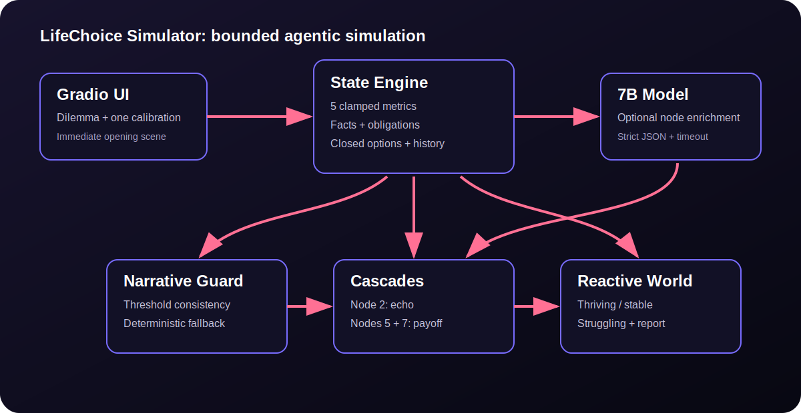
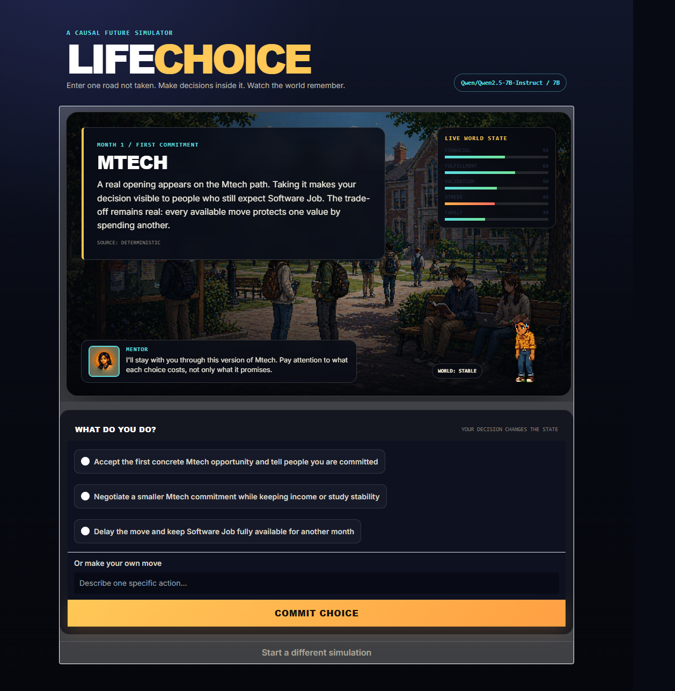
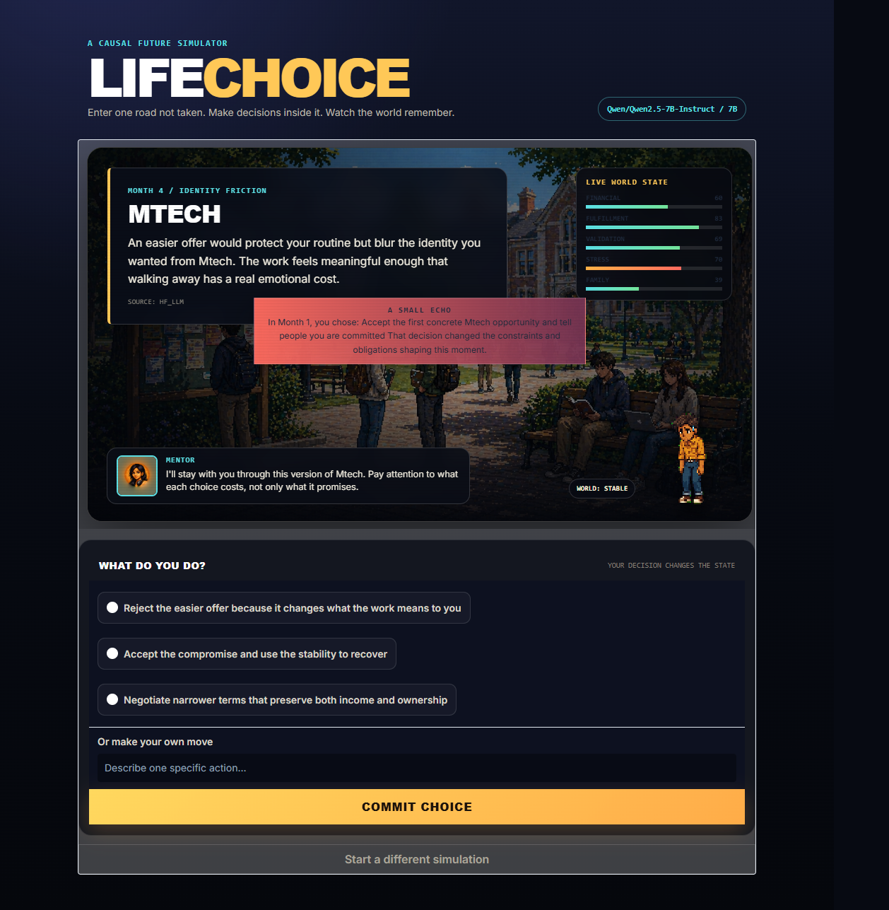
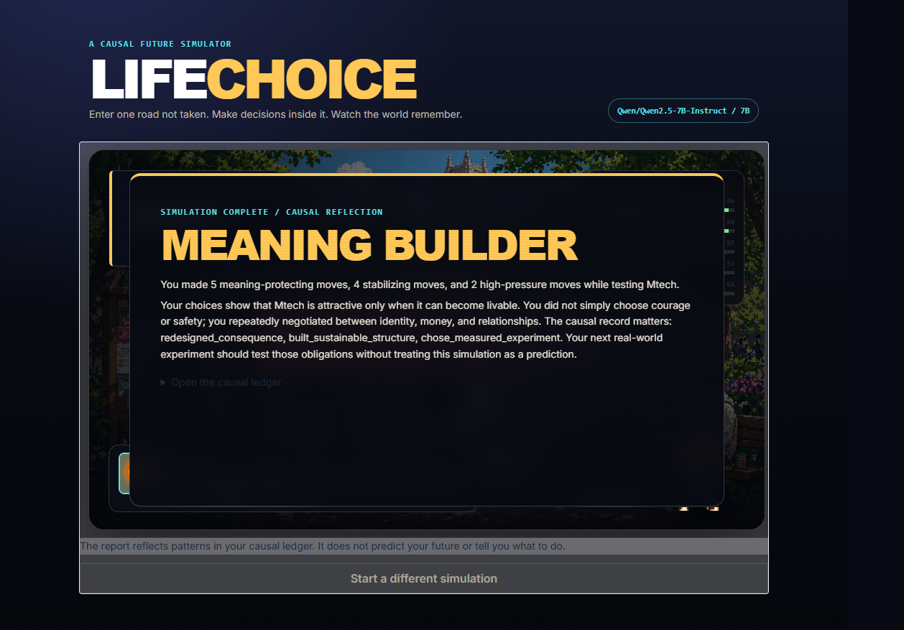

# LifeChoice Simulator

LifeChoice Simulator turns a difficult real-life dilemma into a short, consequential future you can play through. It is designed for reflection, not prediction or advice.



## Live Demo

- Hugging Face Space target: `build-small-hackathon/LifeChoice-Simulator` (organization authorization pending)
- Public demo video: [watch the 22-second walkthrough](https://github.com/Ajey95/LifeChoice-Simulator-Hackathon/raw/main/docs/lifechoice-demo.mp4)
- Social post: publishing pending

The repository includes a longer [demo script](docs/demo-script.md) and [social post draft](docs/social-post.md) ready for public publishing.

## Why It Is Not Just a Chatbot

A chatbot responds turn by turn with prose. LifeChoice runs a stateful simulation engine:

- Every choice changes five deterministic metrics.
- Choices create durable facts, obligations, and closed options.
- Later scenes must respect those causal records and metric thresholds.
- Earlier choices return through three cascade moments.
- The visual environment changes among `thriving`, `stable`, and `struggling`.
- A bounded context packet prevents token growth across the simulation.
- The final report is computed from actual behavior, not a conversational impression.

The language model enriches bounded decision nodes. It does not own arithmetic, state transitions, safety limits, or simulation completion.

## Product Design

LifeChoice is designed around fast entry, bounded generation, and consequences that remain visible:

| Capability | Design |
|---|---|
| Fast onboarding | Dilemma, path, one concrete calibration answer, and one persona selection |
| Immediate play | The opening node is deterministic and available without model latency |
| Efficient generation | One future node is enriched at a time and prefetched in the background |
| Bounded context | Last 3 choices, 8 facts, 5 obligations, and 5 closed options only |
| Stable characters | Characters remain static session data |
| Consistent world state | Threshold facts and narrative validation enforce visible pressure |
| Meaningful choices | Every choice mutates causal facts, obligations, closed options, and metrics |
| Persona continuity | Reactions appear at opening, nodes 1/3/5/7, and critical thresholds |
| Delayed consequences | Small echo at node 2, major consequence at node 5, final payoff at node 7 |
| Reactive visuals | Environment image and metric panel update after every decision |

## Model Compliance

Only one model is configured:

| Model | Parameters | Purpose |
|---|---:|---|
| [`Qwen/Qwen2.5-7B-Instruct`](https://huggingface.co/Qwen/Qwen2.5-7B-Instruct) | 7.616B | Optional bounded node enrichment |

Hugging Face repository metadata reports `7,615,616,512` parameters. No secondary model is configured, and no model at or above 32B is used. If hosted inference is unavailable, the simulation uses deterministic authored nodes and remains fully playable.

Run the compliance test:

```bash
pytest tests/test_model_compliance.py
```

## Architecture

1. Gradio captures a dilemma, chosen path, one calibration fact, and persona.
2. The engine returns an immediate deterministic opening scene.
3. A background worker optionally enriches future nodes with the 7B model.
4. The deterministic state engine applies deltas and updates the causal ledger.
5. Narrative validation rejects generated scenes that contradict critical metrics.
6. The environment derives its visual state from all five metrics.
7. Cascades and the final report use the causal ledger.

## Safety

LifeChoice is a reflective simulation, not medical, legal, financial, mental-health, or career advice. Its futures are fictional hypotheses rather than predictions. Users should not enter secrets or sensitive personal data. High-stakes decisions should be discussed with qualified people who understand the real situation.

Safety controls include:

- Deterministic metric arithmetic and clamping to `0..100`
- Bounded model context
- Strict model-output schema validation
- Deterministic fallback for outages or invalid output
- No autonomous real-world action
- No recommendation of a “correct” path
- Explicit uncertainty and disclaimer text in the UI

## Tech Stack

- Python 3.10+
- Gradio 5
- Hugging Face Hub `InferenceClient`
- `Qwen/Qwen2.5-7B-Instruct` (7B)
- Thread-pool prefetching
- Pytest
- Pixel-art environment assets

## Run Locally

```bash
python -m venv .venv
.\.venv\Scripts\activate
pip install -r requirements.txt
python app.py
```

`HF_TOKEN` is optional. Without it, deterministic fallback content is used.

### Deploy The Organization Space

Authenticate specifically as `Ajeya95`, with write permission in `build-small-hackathon`, then run:

```bash
hf auth login
python scripts/deploy_space.py
```

The deployment script checks both the username and organization role before creating or updating the public Space.

## Tests

```bash
pytest -q
```

The suite covers model-size compliance, bounded context, branch divergence, world-state clamping, state-to-narrative consistency, cascades, persona cadence, and metric-driven environment changes.

## Hackathon Categories

- Thousand Token Wood
- Best Agent
- Best Demo
- OpenAI Prize

This submission does not claim Tiny Titan, OpenBMB, NVIDIA, Modal credits, or Off Brand unless the implementation is later changed to meet those category-specific requirements.

## Built With Codex

Codex built the simulation architecture, Gradio interface, tests, documentation, and deployment workflow. Codex-attributed commits use:

```text
Author: Codex <codex@openai.com>
```

## Screenshots

### Immediate First Scene



### Cascade



### Final Report



## Submission Status

Code, tests, Space metadata, model compliance, safety documentation, architecture, and publishing assets are included. Public URL fields are updated only after the authenticated GitHub repository, Hugging Face organization Space, video, and social post exist.

See the dated [compliance checklist](docs/compliance-checklist.md) for requirement-by-requirement evidence and external blockers.
